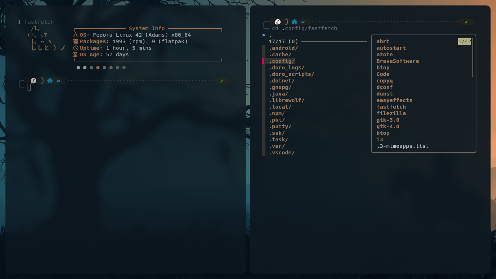
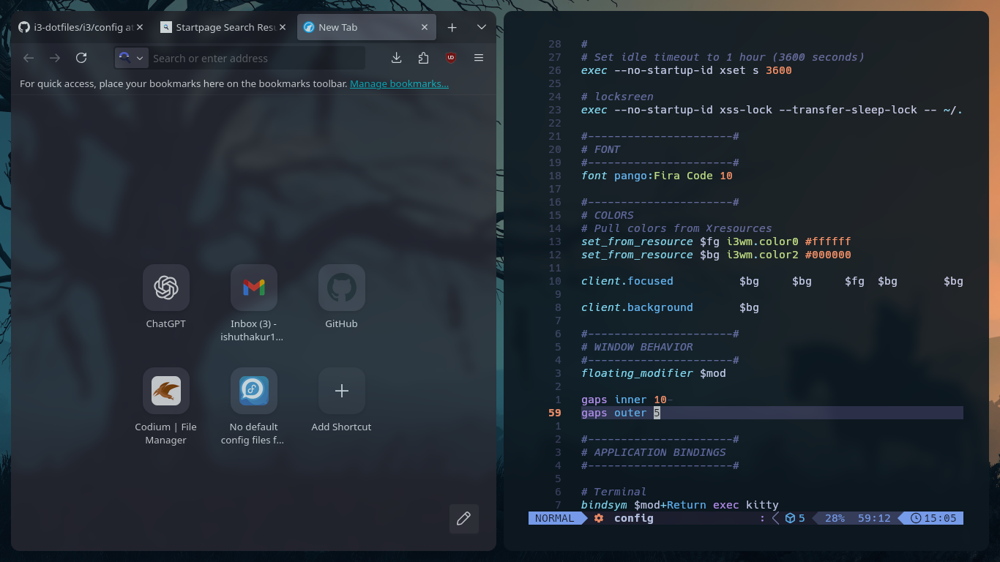

# My i3 Linux Setup

This repository contains my personal Linux configuration files using **i3 window manager**. It’s meant for inspiration and reference.

## Features

- i3 keybindings and workspace layouts without any bars
- Picom for compositing effects
- Rofi/j4-dmenu-desktop launcher
- [Pywal16](https://github.com/eylles/pywal16) Integration with kitty terminal
- Alacritty terminal with custom theme
- Handy scripts
- Ranger 
- Fastfetch 
- .zshrc with powerlevel10k

## Notes

- .sh scripts may need chmod +x to be executable

- Adjust paths in scripts if needed

- Feel free to fork and adapt

## Screenshots

